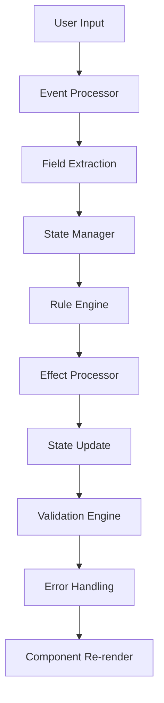

This document provides a detailed look at the internal workings of `createFormHandler`, the core function that powers NovaForms' state management and rule execution system.

---

## Overview

`createFormHandler` is the heart of NovaForms' dynamic form system. It creates a change handler function that:

1. **Manages Form State** - Updates form data and triggers re-renders
2. **Executes Rules** - Processes rule definitions and applies effects
3. **Handles Validation** - Validates field values and displays errors
4. **Manages Field Modifiers** - Applies legacy field-level modifiers
5. **Coordinates Triggers** - Executes field triggers and rule chains

---

## Internal Architecture

### Core Components

```javascript
function createFormHandler(options) {
  // 1. Validation and Setup
  const validatedOptions = validateAndNormalizeOptions(options);
  
  // 2. Create Internal Managers
  const stateManager = new StateManager(validatedOptions.initialState);
  const rulesEngine = new RulesEngine();
  const validationEngine = new ValidationEngine();
  const eventProcessor = new EventProcessor();
  
  // 3. Initialize Systems
  initializeRulesEngine(rulesEngine, validatedOptions.rules);
  initializeValidationEngine(validationEngine, validatedOptions.fields);
  
  // 4. Return Handler Function
  return createHandlerFunction({
    stateManager,
    rulesEngine,
    validationEngine,
    eventProcessor,
    options: validatedOptions
  });
}
```

### Internal Data Flow



---

## Internal Implementation Details

### 1. Options Validation and Normalization

```javascript
function validateAndNormalizeOptions(options) {
  const {
    fields = [],
    setState,
    rules = [],
    validate = false,
    onError = null,
    debug = false,
    initialState = {},
    ...rest
  } = options;
  
  // Validate required options
  if (!fields || !Array.isArray(fields)) {
    throw new NovaFormsError('Fields must be an array', ERROR_TYPES.VALIDATION_ERROR);
  }
  
  if (!setState || typeof setState !== 'function') {
    throw new NovaFormsError('setState must be a function', ERROR_TYPES.VALIDATION_ERROR);
  }
  
  // Normalize field definitions
  const normalizedFields = fields.map(normalizeFieldDefinition);
  
  // Validate rules
  const validatedRules = rules.map(validateRuleDefinition);
  
  return {
    fields: normalizedFields,
    setState,
    rules: validatedRules,
    validate,
    onError,
    debug,
    initialState,
    ...rest
  };
}
```

### 2. State Manager Implementation

```javascript
class StateManager {
  constructor(initialState = {}) {
    this.state = deepClone(initialState);
    this.listeners = new Set();
    this.history = [];
    this.maxHistorySize = 50;
    this.isUpdating = false;
  }
  
  setState(updater) {
    if (this.isUpdating) {
      console.warn('State update already in progress');
      return;
    }
    
    this.isUpdating = true;
    
    try {
      const previousState = deepClone(this.state);
      const newState = typeof updater === 'function' 
        ? updater(this.state) 
        : updater;
      
      // Create state snapshot for history
      this.addToHistory(previousState);
      
      // Update state
      this.state = deepMerge(this.state, newState);
      
      // Notify listeners
      this.notifyListeners(newState, previousState);
      
    } finally {
      this.isUpdating = false;
    }
  }
  
  addToHistory(state) {
    this.history.push({
      state: deepClone(state),
      timestamp: Date.now()
    });
    
    // Limit history size
    if (this.history.length > this.maxHistorySize) {
      this.history.shift();
    }
  }
  
  notifyListeners(newState, previousState) {
    this.listeners.forEach(listener => {
      try {
        listener(newState, previousState);
      } catch (error) {
        console.error('Error in state listener:', error);
      }
    });
  }
}
```

### 3. Rules Engine Implementation

```javascript
class RulesEngine {
  constructor() {
    this.rules = new Map();
    this.executionQueue = [];
    this.isExecuting = false;
    this.executionHistory = [];
  }
  
  addRule(rule) {
    if (!this.validateRule(rule)) {
      throw new RuleExecutionError('Invalid rule definition', rule);
    }
    
    this.rules.set(rule.name, {
      ...rule,
      id: generateRuleId(),
      createdAt: Date.now(),
      executionCount: 0
    });
  }
  
  async executeRule(ruleName, context) {
    const rule = this.rules.get(ruleName);
    if (!rule) {
      throw new RuleExecutionError(`Rule not found: ${ruleName}`, { ruleName });
    }
    
    // Check if rule is already executing
    if (this.isExecuting) {
      this.executionQueue.push({ ruleName, context });
      return;
    }
    
    this.isExecuting = true;
    
    try {
      // Execute rule effects
      await this.processEffects(rule.effects, context);
      
      // Update rule statistics
      rule.executionCount++;
      rule.lastExecuted = Date.now();
      
      // Record execution
      this.recordExecution(ruleName, context);
      
    } catch (error) {
      throw new RuleExecutionError(`Error executing rule: ${ruleName}`, rule, context);
    } finally {
      this.isExecuting = false;
      
      // Process queued rules
      if (this.executionQueue.length > 0) {
        const next = this.executionQueue.shift();
        await this.executeRule(next.ruleName, next.context);
      }
    }
  }
  
  async processEffects(effects, context) {
    const effectPromises = effects.map(effect => 
      this.processEffect(effect, context)
    );
    
    await Promise.all(effectPromises);
  }
  
  async processEffect(effect, context) {
    const { targetField, prop, type, kind, value, sourceFields } = effect;
    
    try {
      switch (type) {
        case 'add':
          await this.executeAddEffect(effect, context);
          break;
        case 'subtract':
          await this.executeSubtractEffect(effect, context);
          break;
        case 'multiply':
          await this.executeMultiplyEffect(effect, context);
          break;
        case 'divide':
          await this.executeDivideEffect(effect, context);
          break;
        case 'replace':
          await this.executeReplaceEffect(effect, context);
          break;
        case 'concat':
          await this.executeConcatEffect(effect, context);
          break;
        case 'readOnly':
          await this.executeAttributeEffect(effect, context);
          break;
        case 'hidden':
          await this.executeAttributeEffect(effect, context);
          break;
        default:
          throw new Error(`Unknown effect type: ${type}`);
      }
    } catch (error) {
      throw new RuleExecutionError(`Error processing effect: ${type}`, effect, context);
    }
  }
}
```

### 4. Event Processor Implementation

```javascript
class EventProcessor {
  constructor() {
    this.eventQueue = [];
    this.isProcessing = false;
  }
  
  processEvent(event, context) {
    // Normalize event
    const normalizedEvent = this.normalizeEvent(event);
    
    // Extract field data
    const fieldData = this.extractFieldData(normalizedEvent);
    
    // Validate field data
    const validationResult = this.validateFieldData(fieldData, context);
    
    if (!validationResult.isValid) {
      throw new ValidationError('Invalid field data', fieldData.field, fieldData.value);
    }
    
    return {
      field: fieldData.field,
      value: fieldData.value,
      previousValue: context.formData[fieldData.field],
      timestamp: Date.now()
    };
  }
  
  normalizeEvent(event) {
    // Handle different event types
    if (event.target) {
      // Standard DOM event
      return {
        name: event.target.name,
        value: event.target.value,
        type: event.type
      };
    } else if (event.name && event.value !== undefined) {
      // Direct value event
      return event;
    } else {
      throw new Error('Invalid event format');
    }
  }
  
  extractFieldData(event) {
    return {
      field: event.name,
      value: this.normalizeValue(event.value),
      type: event.type
    };
  }
  
  normalizeValue(value) {
    // Handle different value types
    if (value === '' || value === null || value === undefined) {
      return null;
    }
    
    // Handle file inputs
    if (value instanceof FileList) {
      return Array.from(value);
    }
    
    // Handle checkbox inputs
    if (typeof value === 'boolean') {
      return value;
    }
    
    // Handle number inputs
    if (typeof value === 'string' && !isNaN(value) && value !== '') {
      return parseFloat(value);
    }
    
    return value;
  }
}
```

### 5. Handler Function Creation

```javascript
function createHandlerFunction({ stateManager, rulesEngine, validationEngine, eventProcessor, options }) {
  return async function handleChange(event) {
    const startTime = performance.now();
    
    try {
      // Process event
      const processedEvent = eventProcessor.processEvent(event, {
        formData: stateManager.getState(),
        fields: options.fields,
        rules: options.rules
      });
      
      // Update state
      stateManager.setState(prevState => ({
        ...prevState,
        [processedEvent.field]: processedEvent.value
      }));
      
      // Execute triggers
      await executeFieldTriggers(processedEvent, options.fields, rulesEngine, stateManager);
      
      // Validate if enabled
      if (options.validate) {
        const validationResult = await validationEngine.validateField(
          processedEvent.field,
          processedEvent.value,
          stateManager.getState()
        );
        
        if (!validationResult.isValid) {
          handleValidationError(validationResult, options.onError);
        }
      }
      
      // Debug logging
      if (options.debug) {
        const endTime = performance.now();
        console.log('Form change processed:', {
          field: processedEvent.field,
          value: processedEvent.value,
          duration: endTime - startTime,
          timestamp: Date.now()
        });
      }
      
    } catch (error) {
      handleError(error, options.onError);
    }
  };
}
```

---

## Internal Helper Functions

### Field Trigger Execution

```javascript
async function executeFieldTriggers(event, fields, rulesEngine, stateManager) {
  const field = fields.find(f => f.name === event.field);
  if (!field || !field.triggers) {
    return;
  }
  
  const context = {
    formData: stateManager.getState(),
    fieldData: { [event.field]: event.value },
    triggerField: event.field,
    triggerValue: event.value,
    timestamp: Date.now()
  };
  
  // Execute all triggers for the field
  const triggerPromises = field.triggers.map(trigger => 
    executeTrigger(trigger, context, rulesEngine)
  );
  
  await Promise.all(triggerPromises);
}

async function executeTrigger(trigger, context, rulesEngine) {
  const { rule, when, value, mode } = trigger;
  
  // Check trigger condition
  const conditionMet = evaluateCondition(when, value, context);
  
  if (conditionMet) {
    await rulesEngine.executeRule(rule, context);
  }
}
```

### Condition Evaluation

```javascript
function evaluateCondition(when, value, context) {
  const { triggerField, triggerValue, formData } = context;
  
  switch (when) {
    case 'equal':
      return triggerValue === value;
    case 'not equal':
      return triggerValue !== value;
    case 'empty':
      return !triggerValue || triggerValue === '';
    case 'not empty':
      return triggerValue && triggerValue !== '';
    case 'less than':
      return triggerValue < value;
    case 'greater than':
      return triggerValue > value;
    case 'between':
      return triggerValue >= value[0] && triggerValue <= value[1];
    case 'matches':
      return new RegExp(value).test(triggerValue);
    default:
      return false;
  }
}
```

### Effect Execution

```javascript
async function executeAddEffect(effect, context) {
  const { targetField, value, kind } = effect;
  const currentValue = context.formData[targetField] || 0;
  
  let newValue;
  if (kind === 'number') {
    newValue = currentValue + value;
  } else {
    newValue = String(currentValue) + String(value);
  }
  
  // Update state
  context.stateManager.setState(prevState => ({
    ...prevState,
    [targetField]: newValue
  }));
}

async function executeConcatEffect(effect, context) {
  const { targetField, sourceFields, value } = effect;
  
  let result = value || '';
  
  if (sourceFields) {
    sourceFields.forEach(source => {
      const fieldValue = context.formData[source.field] || '';
      result += source.charBefore + fieldValue + source.charAfter;
    });
  }
  
  // Update state
  context.stateManager.setState(prevState => ({
    ...prevState,
    [targetField]: result
  }));
}
```

---

## Performance Optimizations

### 1. Debounced Updates

```javascript
class DebouncedStateManager extends StateManager {
  constructor(initialState, debounceMs = 16) {
    super(initialState);
    this.debounceMs = debounceMs;
    this.updateTimeout = null;
  }
  
  setState(updater) {
    // Clear existing timeout
    if (this.updateTimeout) {
      clearTimeout(this.updateTimeout);
    }
    
    // Debounce update
    this.updateTimeout = setTimeout(() => {
      super.setState(updater);
    }, this.debounceMs);
  }
}
```

### 2. Rule Execution Batching

```javascript
class BatchedRulesEngine extends RulesEngine {
  constructor() {
    super();
    this.batchQueue = [];
    this.batchTimeout = null;
  }
  
  executeRule(ruleName, context) {
    // Add to batch queue
    this.batchQueue.push({ ruleName, context });
    
    // Schedule batch execution
    if (!this.batchTimeout) {
      this.batchTimeout = setTimeout(() => {
        this.executeBatch();
      }, 0);
    }
  }
  
  async executeBatch() {
    const batch = [...this.batchQueue];
    this.batchQueue = [];
    this.batchTimeout = null;
    
    // Execute all rules in batch
    await Promise.all(batch.map(({ ruleName, context }) => 
      super.executeRule(ruleName, context)
    ));
  }
}
```

### 3. Field Memoization

```javascript
class MemoizedFieldProcessor extends FieldProcessor {
  constructor(registry, theme) {
    super(registry, theme);
    this.fieldCache = new Map();
    this.renderCache = new Map();
  }
  
  processField(field, context) {
    const cacheKey = this.generateCacheKey(field, context);
    
    if (this.fieldCache.has(cacheKey)) {
      return this.fieldCache.get(cacheKey);
    }
    
    const processed = super.processField(field, context);
    this.fieldCache.set(cacheKey, processed);
    
    return processed;
  }
  
  generateCacheKey(field, context) {
    return `${field.name}-${field.type}-${JSON.stringify(context)}`;
  }
}
```

---

## Error Handling and Recovery

### Error Types and Handling

```javascript
class HandlerErrorHandler {
  constructor(options) {
    this.options = options;
    this.errorCount = 0;
    this.maxErrors = 100;
  }
  
  handleError(error, context) {
    this.errorCount++;
    
    if (this.errorCount > this.maxErrors) {
      console.error('Too many errors, disabling handler');
      return;
    }
    
    // Log error
    console.error('Handler error:', error, context);
    
    // Call error callback
    if (this.options.onError) {
      try {
        this.options.onError(error, context);
      } catch (callbackError) {
        console.error('Error in error callback:', callbackError);
      }
    }
    
    // Attempt recovery
    this.attemptRecovery(error, context);
  }
  
  attemptRecovery(error, context) {
    // Reset state if possible
    if (error.type === ERROR_TYPES.STATE_UPDATE_ERROR) {
      this.resetState();
    }
    
    // Clear rule cache if rule execution failed
    if (error.type === ERROR_TYPES.RULE_EXECUTION_ERROR) {
      this.clearRuleCache();
    }
  }
}
```

---

## Debugging and Development Tools

### Debug Mode Implementation

```javascript
class DebugManager {
  constructor(enabled = false) {
    this.enabled = enabled;
    this.logs = [];
    this.maxLogs = 1000;
  }
  
  log(message, data = {}) {
    if (!this.enabled) return;
    
    const logEntry = {
      message,
      data,
      timestamp: Date.now(),
      stack: new Error().stack
    };
    
    this.logs.push(logEntry);
    
    // Limit log size
    if (this.logs.length > this.maxLogs) {
      this.logs.shift();
    }
    
    console.log(`[NovaForms Debug] ${message}`, data);
  }
  
  getLogs() {
    return [...this.logs];
  }
  
  clearLogs() {
    this.logs = [];
  }
}
```

### Performance Monitoring

```javascript
class PerformanceMonitor {
  constructor() {
    this.metrics = {
      stateUpdates: 0,
      ruleExecutions: 0,
      averageExecutionTime: 0,
      totalExecutionTime: 0
    };
  }
  
  recordStateUpdate(duration) {
    this.metrics.stateUpdates++;
    this.updateAverageTime(duration);
  }
  
  recordRuleExecution(duration) {
    this.metrics.ruleExecutions++;
    this.updateAverageTime(duration);
  }
  
  updateAverageTime(duration) {
    this.metrics.totalExecutionTime += duration;
    this.metrics.averageExecutionTime = 
      this.metrics.totalExecutionTime / 
      (this.metrics.stateUpdates + this.metrics.ruleExecutions);
  }
  
  getMetrics() {
    return { ...this.metrics };
  }
}
```

---

## Testing and Mocking

### Test Utilities

```javascript
// Mock createFormHandler for testing
export function createMockFormHandler(options = {}) {
  const mockState = { ...options.initialState };
  const mockSetState = jest.fn((updater) => {
    if (typeof updater === 'function') {
      Object.assign(mockState, updater(mockState));
    } else {
      Object.assign(mockState, updater);
    }
  });
  
  return {
    handler: jest.fn(async (event) => {
      const { name, value } = event.target || event;
      mockSetState({ [name]: value });
    }),
    getState: () => mockState,
    setState: mockSetState
  };
}

// Test rule execution
export function createMockRulesEngine() {
  const executedRules = [];
  
  return {
    executeRule: jest.fn(async (ruleName, context) => {
      executedRules.push({ ruleName, context });
    }),
    getExecutedRules: () => executedRules,
    clearExecutedRules: () => executedRules.length = 0
  };
}
```

---

*This document provides a comprehensive look at the internal workings of `createFormHandler`. It's intended for NovaForms contributors and advanced developers who need to understand or modify the core functionality.*
